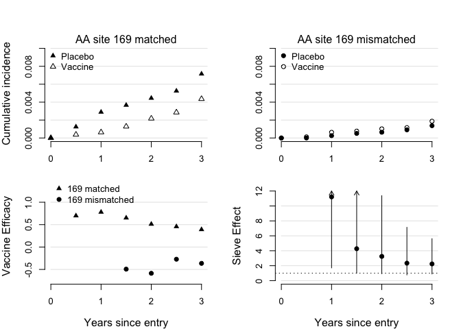

Installation of `survtmle` package
----------------------------------

And beta verion of an `R` package is currently available on GitHub and can be installed as follows.

``` r
# need devtools package for github install
library(devtools)

# install from github
install_github("benkeser/survtmle")

# load library
library(survtmle)
```

The main function in the package is the `survtmle` function, which computes the cumulative incidence for specified failure type(s). See `?survtmle` for more details, including examples using simulated data.

Mock RV144 analysis
-------------------

Below, we produce an analysis of the mock RV144 data that are included with the `survtmle` package. See `?rv144` for more description of the data set.

``` r
# load the data from the package
data(rv144)

# look at the first 6 rows of data
head(rv144)
```

    ##   ftime ftype vax male year04 year05 medRisk highRisk medAge highAge
    ## 1     6     0   0    1      1      0       1        0      0       0
    ## 2     6     0   1    1      0      0       1        0      1       0
    ## 3     6     0   1    1      0      1       1        0      0       0
    ## 4     6     0   0    0      1      0       0        0      0       1
    ## 5     3     0   0    0      0      1       0        1      1       0
    ## 6     6     0   1    1      0      1       1        0      0       1

Below we implement code that estimates the cumulative incidence for both matched and mismatched infections in both the vaccine and treatment arms. For computational convenience, we use a simplified Super Learner library relative to the one used in the manuscript. If one desires to use the same library as in the manuscript, those functions are available in the `superlearnerfunctions.R` file.

``` r
# will need package rpart and randomforest
library(rpart)
library(randomForest)
```

    ## randomForest 4.6-12

    ## Type rfNews() to see new features/changes/bug fixes.

``` r
# set a seed because superlearner uses cross validation
set.seed(12345)

# fit the tmle at the last time point using survtmle
tmle.fit <- survtmle(
    ftime = rv144$ftime, 
    ftype = rv144$ftype,
    trt = rv144$vax,
    t0 = 6, # final timepoint, 3 years post enrollment
    adjustVars = rv144[,4:10], # baseline covariates
    glm.trt = "1", # empirical estimates of treatment probabilities
    SL.ftime = c("SL.glm","SL.mean","SL.rpart"),
    SL.ctime = c("SL.glm","SL.mean","SL.rpart"),
    method = "mean", # for iterative mean-based tmle
    verbose = FALSE, 
    returnModels = TRUE # return super learner fits for use with timepoints()
 )

# take a look at the output
tmle.fit
```

    ## $est
    ##            [,1]
    ## 0 1 0.007150713
    ## 1 1 0.004356130
    ## 0 2 0.001371584
    ## 1 2 0.001871588
    ## 
    ## $var
    ##               0 1           1 1           0 2           1 2
    ## 0 1  9.530630e-07  1.163370e-10 -1.304589e-09  1.261261e-10
    ## 1 1  1.163370e-10  5.832930e-07  2.708323e-11 -1.146398e-09
    ## 0 2 -1.304589e-09  2.708323e-11  1.835037e-07  1.173578e-11
    ## 1 2  1.261261e-10 -1.146398e-09  1.173578e-11  2.550053e-07

We can now use a call to the `timepoints` function in the `survtmle` package to obtain estimates at the first five scheduled visits.

``` r
# call timepoints to estimate incidence at each timepoint
tp.fit <- timepoints(
    object = tmle.fit, 
    times = 1:6, 
    returnModels = FALSE
    )

# check out the results for a single timepoint, e.g. t = 3
tp.fit$t3
```

    ## $est
    ##             [,1]
    ## 0 1 0.0036631222
    ## 1 1 0.0012796087
    ## 0 2 0.0005103480
    ## 1 2 0.0007621896
    ## 
    ## $var
    ##               0 1           1 1           0 2           1 2
    ## 0 1  4.605608e-07  5.287881e-11 -2.428045e-10  6.110277e-11
    ## 1 1  5.287881e-11  1.592924e-07  1.123397e-11 -1.527312e-10
    ## 0 2 -2.428045e-10  1.123397e-11  6.437163e-08  6.872899e-12
    ## 1 2  6.110277e-11 -1.527312e-10  6.872899e-12  9.505477e-08

We now define a function `getVE` that we use to help transform the results from the cumulative incidence scale to the vaccine efficacy and vaccine sieve effects scale. The function is not yet included in the `survtmle` package, but may be in the future.

``` r
#' getVE
#' 
#' A function that uses output from a survtmle object to compute
#' vaccine efficacy and vaccine sieve effect estimates
#' 
#' @param out A \code{survtmle} object with two types of failure
#' and two treatment types. 
#' @param tol Level of incidence below which not to compute VE. 
#' If incidence is very small in the placebo arm the asymmetric scale of VE can
#' cause very small values of VE. 
#' @return A list of data.frames whose first row is the vaccine efficacy against 
#' type 1 endpoints, second row is vaccine efficacy against type 2 endpoints
#' and third row is vaccine sieve effect. In each row the first entry corresponds
#' to the effect estimate, the second and third to the lower and upper confidence 
#' limits, and the fourth to the p-value for the Wald test of the 
#' relevant hypothesis test (VE = 0 or VSE = 1).

getVE <- function(out, tol = 1e-10){
    fnOut <- lapply(out, function(rslt){
        # check for very small values of cumulative incidence
        # that lead to very large/small values of VE
        if(all(rslt$est[1:2] > tol)){ 
            # ve against type 1 endpoints
            ve1 <- 1 - rslt$est[2]/rslt$est[1]
            # relative risk on the log scale
            log.rr1 <- log(rslt$est[2]/rslt$est[1])
            # gradient used for se computation on log-scale
            a <- matrix(c(-1/rslt$est[1], 1/rslt$est[2]),nrow=2)
            # standard error on the log scale for relative risk
            se.log.rr1 <- sqrt(t(a)%*%rslt$var[1:2,1:2]%*%a)
            # confidence interval
            ve1.low <- 1 - exp(log.rr1 + 1.96*se.log.rr1)
            ve1.high <- 1 - exp(log.rr1 - 1.96*se.log.rr1)
            # two sided p-value
            p1 <- 2*pnorm(-abs(log.rr1/se.log.rr1))
        }else{
            ve1 <- ve1.low <- ve1.high <- p1 <- NA
        }
        
        if(all(rslt$est[3:4] > tol)){
           # type 2 proceed exactly as above
            ve2 <- 1 - rslt$est[4]/rslt$est[3]
            log.rr2 <- log(rslt$est[4]/rslt$est[3])
            a <- matrix(c(-1/rslt$est[3], 1/rslt$est[4]),nrow=2)
            se.log.rr2 <- sqrt(t(a)%*%rslt$var[(3:4),(3:4)]%*%a)
            ve2.low <- 1 - exp(log.rr2 + 1.96*se.log.rr2)
            ve2.high <- 1 - exp(log.rr2 - 1.96*se.log.rr2)
            p2 <- 2*pnorm(-abs(log.rr2/se.log.rr2))  
        }else{
            ve2 <- ve2.low <- ve2.high <- p2 <- NA
        }
        
        if(all(rslt$est > tol)){
           # vaccine sieve effect
            sieve <- exp(log.rr2 - log.rr1)
            # on the log scale
            log.sieve <- log.rr2 - log.rr1
            # gradient used to compute standard error on the log scale
            a <- matrix(c(1/rslt$est[1], -1/rslt$est[2],
                          -1/rslt$est[3], 1/rslt$est[4]),nrow=4)
            # standard error
            se.log.sieve <- sqrt(t(a)%*%rslt$var%*%a)
            # confidence interval
            sieve.low <- exp(log.sieve -1.96*se.log.sieve)
            sieve.high <- exp(log.sieve +1.96*se.log.sieve)
            # p-value for hypothesis test
            sieve.p <- 2*pnorm(-abs(log.sieve/se.log.sieve))
        }else{
            sieve <- sieve.low <- sieve.high <- sieve.p <- NA
        }
        
        # return a matrix
        tmp <- data.frame(
            rbind(c(ve1, ve1.low, ve1.high, p1),
                  c(ve2, ve2.low, ve2.high, p2),
                  c(sieve, sieve.low, sieve.high, sieve.p)
        ))
        row.names(tmp) <- c("ve1","ve2","vse")
        colnames(tmp) <- c("est","ci.low","ci.high","p")
        return(tmp)
    })
    fnOut
}

# get the ve and vse 
ve.fit <- getVE(tp.fit)

# look at the results at time 6
ve.fit$t6
```

    ##            est      ci.low   ci.high          p
    ## ve1  0.3908118  0.05835564 0.6058912 0.02570707
    ## ve2 -0.3645449 -2.06406882 0.3923169 0.45138282
    ## vse  2.2399398  0.89274302 5.6201283 0.08574857

Plotting the results
--------------------

Below is the plot code used to generate the manuscript figures.

``` r
# figure dimensions -- used to compute appropriate margins
figure.width <- 8
figure.height <- 5.5
# computing appropriate margins
par(mar=c(4.1,0,0,0))
left.1 <- par()$mai[1]
par(mar=c(4.1,0,0,0))
right.1 <- par()$mai[1]
left.2 <- right.2 <- right.1
bottom.1 <- upper.2 <- right.1
bottom.2 <- upper.1 <- left.1
thisCex <- 1
x <- (figure.width - (left.1 + right.1 + left.2 + right.2))/2
wid <- rep(c(1,(x+left.2+right.2)/(x+left.1+right.1)),2)
x <- (figure.height - (upper.1 + upper.2 + bottom.1 + bottom.2))/2
hei <- c((x+upper.2+bottom.2)/(x+upper.1+bottom.1),1,1,(x+upper.2+bottom.2)/(x+upper.1+bottom.1))

# set up the layout
layout(matrix(c(1,3,2,4),2,2),width=wid)
# make the top row of plots
for(j in 1:2){
  if(j==2){
    par(mar=c(2.1,4.1,4.1,2.1))
    main.tit <- ""
    yl <- ""
  }else if(j==1){
    par(mar=c(2.1,4.1,4.1,2.1))
    main.tit <- ""
    yl <- "Cumulative incidence"
  }
  # get vector of cumulative incidence in vaccine arm
  f0.hat <- unlist(lapply(tp.fit, function(f){
      f$est[(2*j - 1)]
  }))
  # get vector of cumualtive incidence in vaccine arm
  f1.hat <- unlist(lapply(tp.fit, function(f){
      f$est[(2*j)]
  }))
  
  plot(c(0,f0.hat)~I(0:6),cex.lab=1.2,pch="",col=1,
       ylim=c(0,0.010),bty="n",cex=thisCex,
       #     ylim=c(0,0.004),
       ylab=yl,
       xaxt="n",xlab="Years since entry",
       main=main.tit)
  segments(x0=0,x1=7, y0=seq(0,0.010,0.002),col="gray90")
  points(c(0,f0.hat)~I(0:6),pch=ifelse(j==2,19,17),col=1,cex=thisCex)
  points(c(0,f1.hat)~I(0:6),pch=ifelse(j==2,1,2),col=1,cex=thisCex)
  axis(side=1, at=seq(0,6,2),label=seq(0,3,1))
  legend(x="topleft",pch=ifelse(rep(j,2)==c(2,2),c(19,1),c(17,2)),col=1,
         bty="n",
         legend=c("Placebo","Vaccine"))
  mtext(side=3,paste0("AA site 169",ifelse(j==1," matched"," mismatched")))
}

#-------------------------
# vaccine efficacy plot
#-------------------------
# get matrix of vaccine efficacies, first column = matched
veMat <- Reduce("rbind", lapply(ve.fit,function(f){
    f$est[1:2]
}))

par(mar=c(4.1,4.1,2.1,2.1))
yl <- "Vaccine Efficacy"
y.lim <- c(-0.75,1.25)
plot(c(0,veMat[,1])~I(0:6),ylab=yl,col=1,
     xlab="Years since entry",cex.lab=1.2,xaxt="n",bty="n",cex=thisCex,
     ylim=y.lim,pch="")
segments(x0=0,x1=7, y0=seq(-1,1,0.5),col="gray90")
points(veMat[1:6,1]~I(1:6),ylab=yl,col=1,pch=17)
points(veMat[2:6,2]~I(2:6),ylab=yl,col=1,pch=19,lty=2)
axis(side=1, at=seq(0,6,2),label=seq(0,3,1))
legend(x=0,y=1.55,xpd=TRUE, pch=c(17,19),col=1,bty="n",
       legend=c("169 matched","169 mismatched"))

#-------------------------
# sieve effect plot
#-------------------------
# get vector of vse
vse <- Reduce("rbind", lapply(ve.fit,function(f){
    f["vse",1:3]
}))

par(mar=c(4.1,4.1,2.1,2.1))
yl <- "Sieve Effect"
y.lim <- c(0,12)

plot(c(0,0,vse[2:6,1])~I(0:6),ylab=yl,col=1,
     xlab="Years since entry",cex.lab=1.2,xaxt="n",bty="n",cex=thisCex,
     ylim=y.lim,pch="")
segments(x0=0,x1=7, y0=seq(0,10,2),col="gray90")
points(vse[2:6,1]~I(2:6),ylab=yl,col=1,pch=19)
axis(side=1, at=seq(0,6,2),label=seq(0,3,1))
abline(h=1,lty=3)
segments(x0=4:6,y0=vse[4:6,2],y1=vse[4:6,3])
arrows(x0=2:3,y0=vse[2:3,2],y1=12,length=0.075)
```


